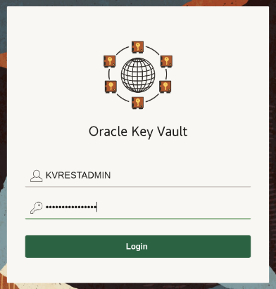
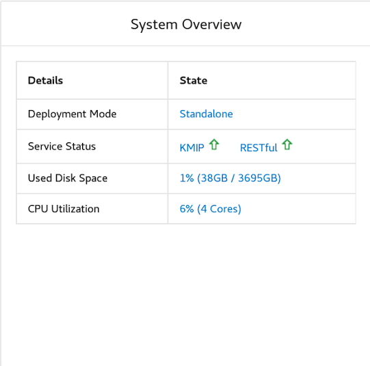
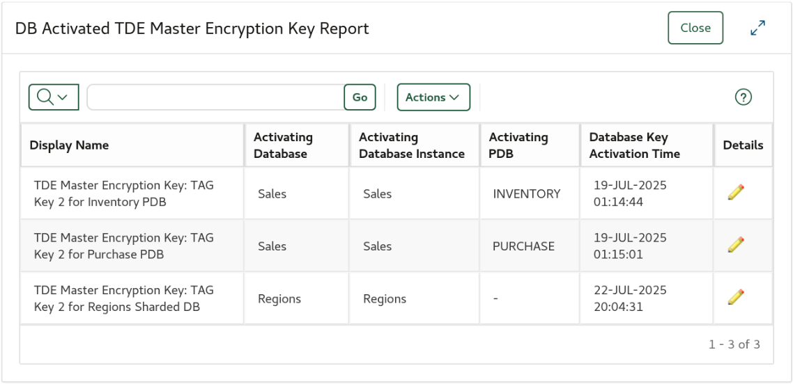
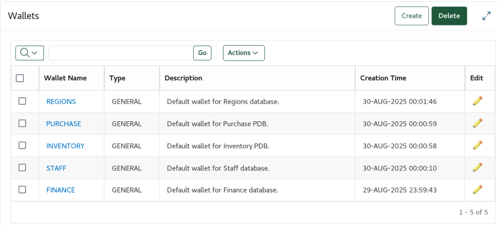
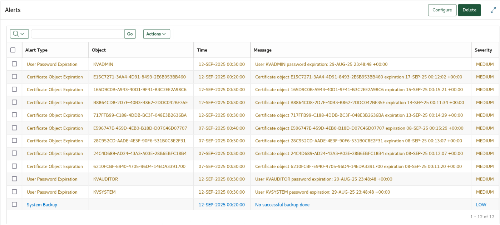
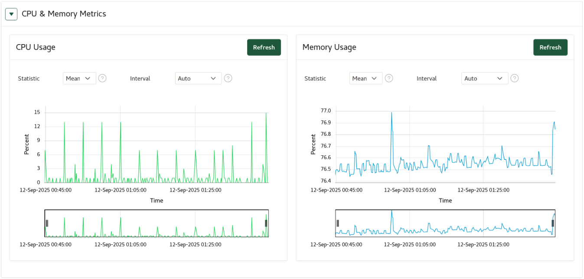
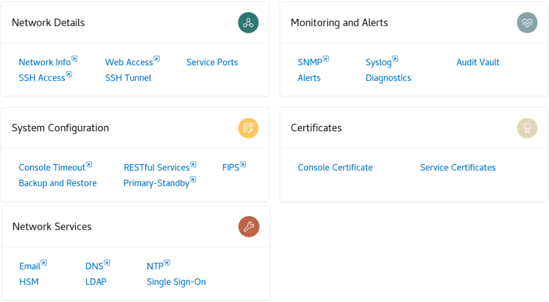
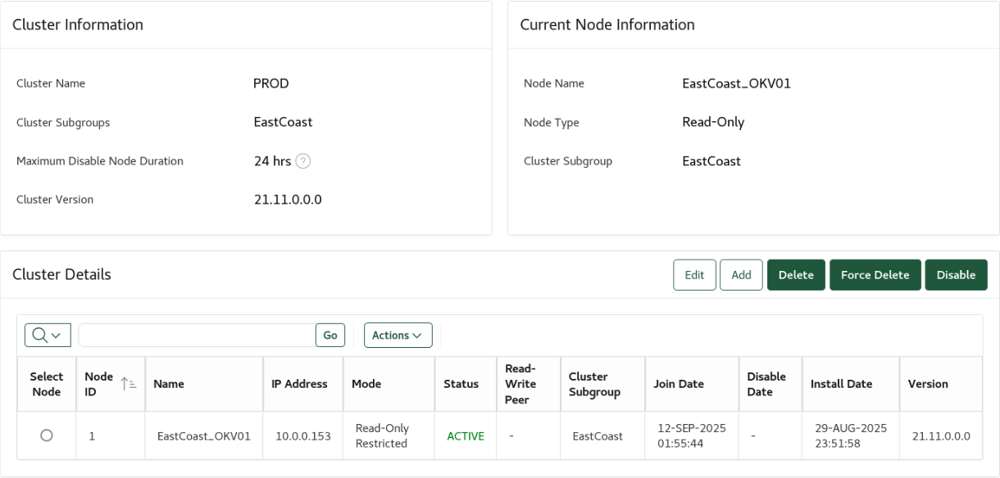

# Explore Key Vault in a typical customer deployment

## Introduction
Oracle Key Vault can be deployed in numerous configurations to suit different organizational needs. Deployment options include standalone installations for simpler environments, multi-master clusters for high availability and scalability, as well as support for Oracle Real Application Clusters (RAC). In addition, Oracle Key Vault is designed to operate seamlessly across diverse infrastructure architectures, including multi-cloud and hybrid environments, as well as traditional on-premises and fully cloud-based deployments.
Oracle Key Vault serves as a centralized key management platform, providing secure storage and management for a wide range of sensitive cryptographic material. It is designed to manage TDE master encryption keys, symmetric keys, private and public keys, SSH keys, Oracle GoldenGate keys, and digital certificates, among others.
Oracle Key Vault provides many rich and meaningful activity, audit and awareness reports that support you in keeping your business running in a secure fashion without unneccessay and avoidable interruptions.

Estimated Lab Time: 5 minutes

### Objectives
In this lab, you will explore Oracle Key Vault's actionable reports and learn how to interpret them - for example identifying which TDE master encryption keys need to be re-keyed, which certificates are nearing expiration or no longer satisfy stricter compliance requirements.

### Prerequisites
This lab assumes you have completed lab 11.

## Task 1: Utilize the OKV reports to keep your business running

1. Login to Key Vault as user **KVRESTADMIN**

     

2. Click the **Reports** Tab:

    

3. System Overview before clustering:

    

4. Key Management Report:

    

5. DB Activated TDE Master Encryption Key Report:

    

6. Endpoints page:

    

7. Wallets page:

    

8. Alerts page:

    

9. Manager Users page:

    

10. Empty LDAP Group Mappings:

    

11. Change user password:

    

12. CPU and memory metrics:

    

13. Settings page:

    

14. Configure as Candidate node:

    

15. Cluster page:

    

16. System overview after clustering:

    