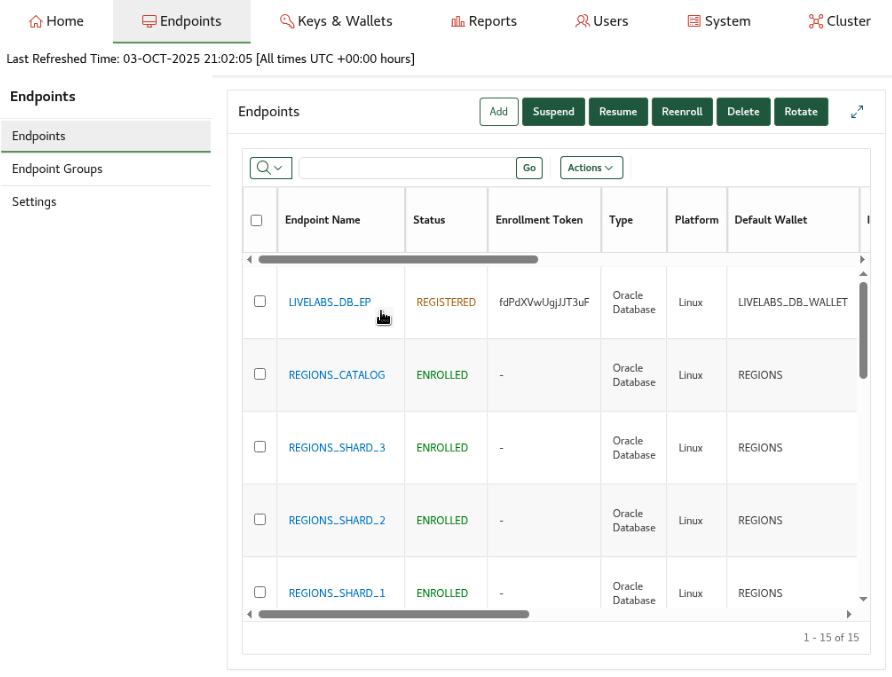
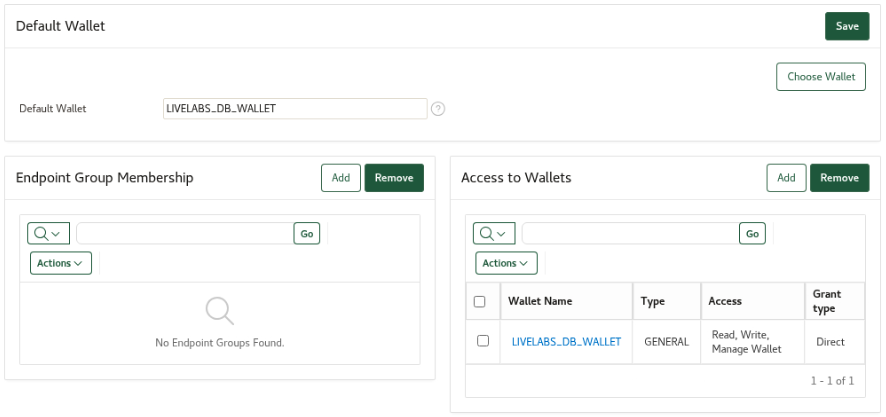
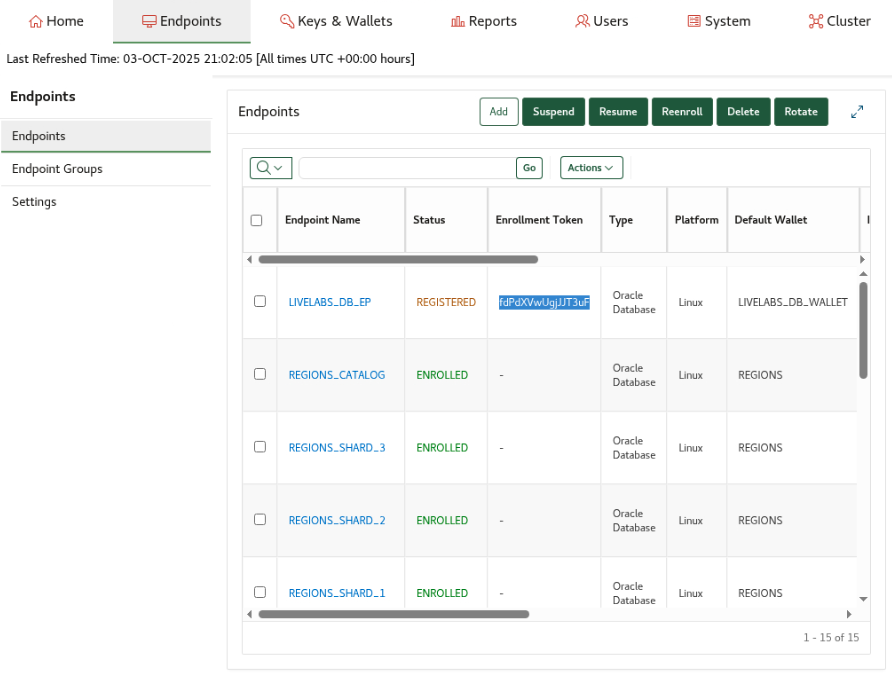
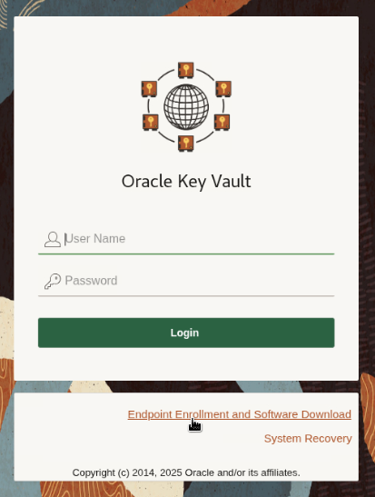
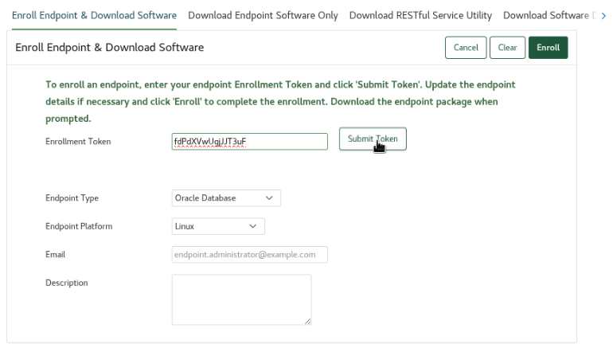
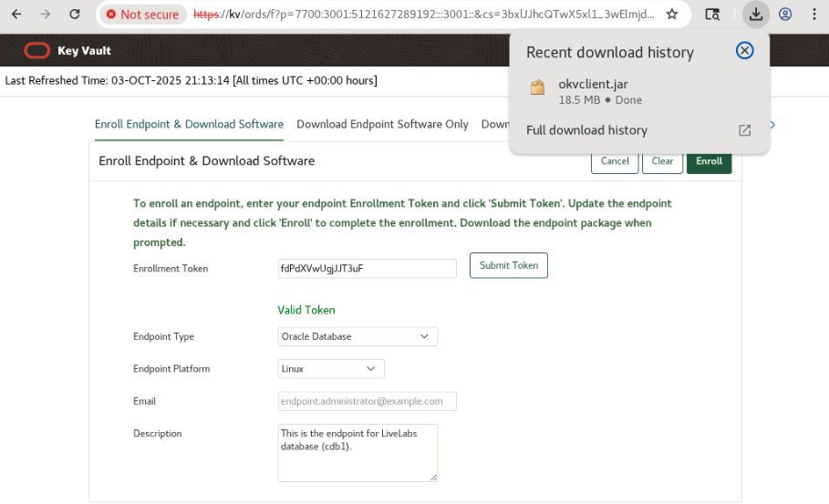
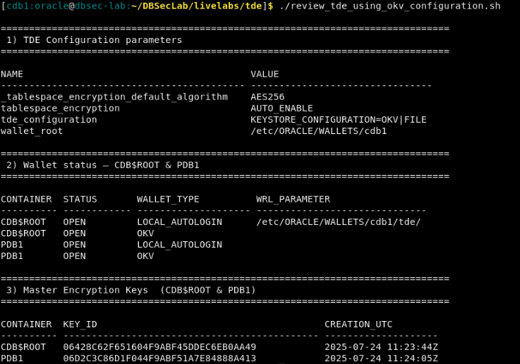

# Migrate to OKV in 5 easy steps

## Introduction
To use Oracle Key Vault as your centralized key manager, you need to migrate your Oracle databases from a local TDE wallet to Key Vault.

Estimated Lab Time: 15 minutes

### Objectives
In this lab, you will learn how to onboard the Oracle database to Oracle Key Vault, and how to migrate your keys from the TDE wallet to Key Vault.

### Prerequisites
This lab assumes you have completed lab 4.

## Task 1: Enroll the incoming Oracle database into Oracle Key Vault

1.  Login to Key Vault as user **KVEPADMIN**

    For the password, execute the following command

    ```
    <copy>
    cat wui_passphrase
    </copy>
    ```

    

2. Click the **Endpoints** tab

    

3.  Click on **Add** to add a new endpoint

    The endpoint represents the Oracle database in Oracle Key Vault.

    

4.  Provide the endpoint details and click **Register**

    We recommend using LIVELABS\_DB\_EP for the **Endpoint Name**
    ```plaintext
    <copy>
    LIVELABS_DB_EP
    </copy>
    ```
    And using the following text for the **Description**
    ```plaintext
    <copy>
    This is the endpoint for LiveLabs database (cdb1).
    </copy>
    ```

    .'; Click 'Register'")


5.  Click on **Register** to register this new endpoint

6.  Click the newly created endpoint **LIVELABS\_DB\_EP** to view the details for this endpoint

    

7.  On the endpoint details page, add **LIVELABS\_DB\_WALLET** as the default wallet and click **Save**

    By setting up a default wallet, all new keys of the database will be a part of this wallet.

    ```plaintext
    <copy>
    LIVELABS_DB_WALLET
    </copy>
    ```

    

8.  Verify that the permissions of the Default Wallet (LIVELABS\_DB\_WALLET) show 'Read, Write, Manage Wallet' by checking the **Access to Wallets** section of this page

    

9.  Click the **Endpoints** tab and copy the **Enrollment Token** for **LIVELABS\_DB\_EP**

    

10. Click **Logout** on the right-hand corner of the page

    

## Task 2: Download the Oracle Key Vault client software for this database

1.  On the database host, go to the Key Vault login page, click on **Endpoint Enrollment and Software Download**

    

2.  Provide the Enrollment Token and click **Submit Token**. Endpoint details will be automatically populated.

    

3.  Click **Enroll** to download the "okvclient.jar" file. The file is downloaded to your database host.

    

## Task 3: Deploy the Oracle Key Vault client software on the database host

1.  Setup the Key Vault endpoint home. This is the base of operations for the endpoint software

    ```
    <copy>
    export OKV_HOME=/etc/ORACLE/WALLETS/cdb1/okv
    </copy>
    ```

2.  Install the Key Vault software. This will prompt for the endpoint connection password. We will refer to this as the "Key Vault endpoint password"

    ```
    <copy>
    java -jar ~/Downloads/okvclient.jar -d $OKV_HOME
    </copy>
    ```

    

3.  Review details under the Key Vault endpoint home

    ```
    <copy>
    tree $OKV_HOME
    </copy>
    ```

    

4.  Deploy the Key Vault library (liborapkcs.so) that the database will use to communicate with Key Vault

    ```
    <copy>
    sudo $OKV_HOME/bin/root.sh
    </copy>
    ```

     that the database will use to communicate with Key Vault")

## Task 4: Prepare the database for the migration to Oracle Key Vault

1.  Change the TDE configuration to OKV|FILE

    ```
    <copy>
    sqlplus / AS SYSDBA
    alter system set TDE_CONFIGURATION = 'KEYSTORE_CONFIGURATION=OKV|FILE' scope = BOTH;
    </copy>
    ```

    

## Task 5: Migrate the database to use Oracle Key Vault for centralized key management

1.  Migrate the database to use Key Vault

    ```
    <copy>
    sqlplus / AS SYSDBA
    ADMINISTER KEY MANAGEMENT SET KEY IDENTIFIED BY "<Key Vault endpoint password>" FORCE KEYSTORE MIGRATE USING "<TDE wallet password>";
    </copy>
    ```

    

2.  Migration is always a re-key operation. There are two new keys created in Key Vault: one for the CDB$ROOT and one for PDB1

    ```
    <copy>
    $OKV_HOME/bin/okvutil list
    </copy>
    ```

    

3.  Review the database setup after migrating to Key Vault

    ```
    <copy>
    ./review_tde_using_okv_configuration.sh
    </copy>
    ```

    **WHEN RUNNING THIS SCRIPT AFTER MIGRATION, THE FORMATTING IS ALL WHACK**

    